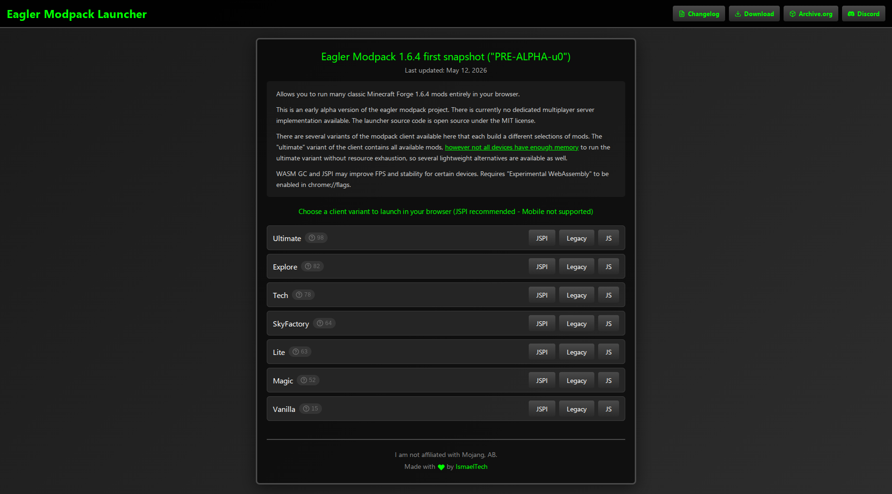
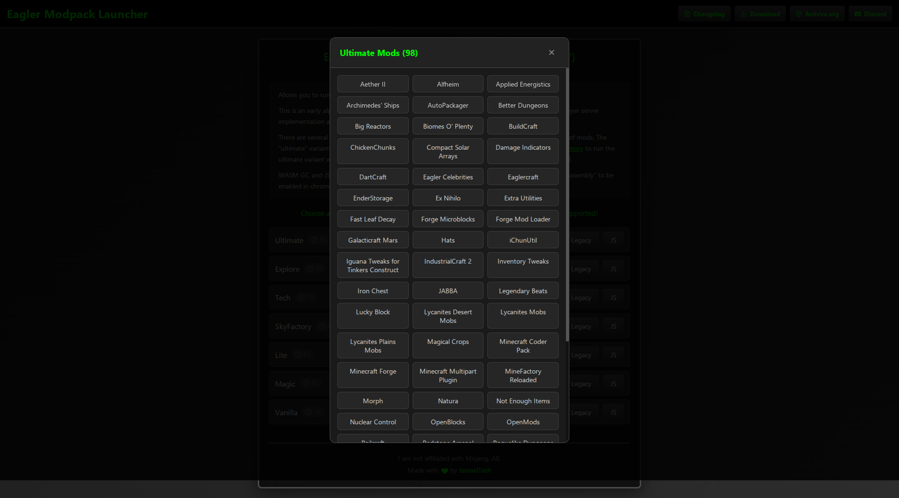
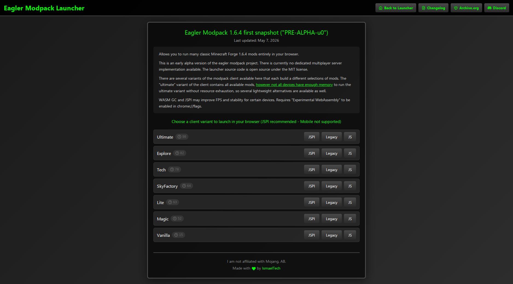
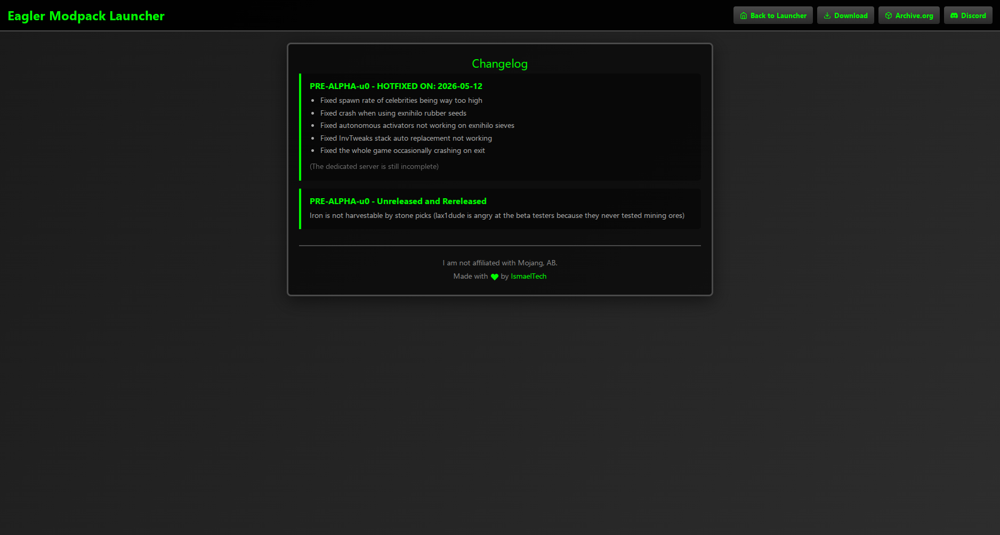

<div align="center">

# Eagler Modpack Launcher

> Classic Minecraft Forge 1.6.4 modpacks running entirely in your browser.

<p align="center">
  <a href="https://discord.com/invite/gNgrNhrQYU">
    
  </a>
  <a href="https://archive.org/details/eagler-modpack-1.6.4-first-snapshot">
    
  </a>
</p>

</div>

---



| Mods Popup | Downloads | Changelog |
|:---:|:---:|:---:|
|  |  |  |

---

## WTH is ts???

**PRE-ALPHA-u0** - No multiplayer server yet - Source not yet public - Relays are not working

7 variants of Minecraft Forge 1.6.4 modpacks. Pick a variant then enjoy playing with mods within your browser and you could do it offline too.

Each pack has three builds:

→ **JSPI** *(recommended)*
→ **Legacy**
→ **JS**

> Desktop only. Mobile is not supported.

---

## Modpacks

| Pack | Mods | What's in it |
|------|:----:|--------------|
| Ultimate | 98 | All available mods in one client. **High RAM usage**. |
| Explore | 82 | Biomes, dimensions, all 11 Lycanites mob sets... |
| Tech | 78 | BuildCraft, IC2, Applied Energistics, Railcraft, Nuclear Control... |
| SkyFactory | 64 | Skyblock via Ex Nihilo + YUNoMakeGoodMap void world.. |
| Lite | 63 | Lighter option, QoL mods |
| Magic | 52 | Thaumcraft, Witchery, Lycanites..., heavy RPG/magic focus |
| Vanilla | 15 | QoL mods only |

---

### Full Mod Lists

<details>
<summary><b>Ultimate - 98 mods</b></summary>

Aether II, Alfheim, Applied Energistics, Archimedes' Ships, AutoPackager, Better Dungeons, Big Reactors, Biomes O' Plenty, BuildCraft, ChickenChunks, Compact Solar Arrays, Damage Indicators, DartCraft, Eagler Celebrities, Eaglercraft, EnderStorage, Ex Nihilo, Extra Utilities, Fast Leaf Decay, Forge Microblocks, Forge Mod Loader, Galacticraft Mars, Hats, iChunUtil, Iguana Tweaks for Tinkers Construct, IndustrialCraft 2, Inventory Tweaks, Iron Chest, JABBA, Legendary Beats, Lucky Block, Lycanites Desert Mobs, Lycanites Mobs, Lycanites Plains Mobs, Magical Crops, Minecraft Coder Pack, Minecraft Forge, Minecraft Multipart Plugin, MineFactory Reloaded, Morph, Natura, Not Enough Items, Nuclear Control, OpenBlocks, OpenMods, Railcraft, Redstone Arsenal, Roguelike Dungeons, Thaumcraft, The Secret Rooms Mod, The Twilight Forest, Thermal Expansion, TiC Tooltips, Tinkers' Construct, Tinkers' Merchworks, TooMuchTNT, Tree Growing Simulator 2014, Waila, Waila Havestability, Witchery, YUNoMakeGoodMap

</details>

<details>
<summary><b>Explore - 82 mods</b></summary>

Aether II, Alfheim, Applied Energistics, Archimedes' Ships, Better Dungeons, Big Reactors, Biomes O' Plenty, ChickenChunks, Damage Indicators, DartCraft, Eagler Celebrities, Eaglercraft, EnderStorage, Extra Utilities, Fast Leaf Decay, Forge Microblocks, Forge Mod Loader, Forge Multipart, Galacticraft Mars, Hats, HatStand, iChunUtil, Iguana Tweaks for Tinkers Construct, Inventory Tweaks, Iron Chest, JABBA, Legendary Beats, Lucky Block, Lycanites Arctic Mobs, Lycanites Demon Mobs, Lycanites Desert Mobs, Lycanites Forest Mobs, Lycanites Inferno Mobs, Lycanites Jungle Mobs, Lycanites Mobs, Lycanites Mountain Mobs, Lycanites Plains Mobs, Lycanites Saltwater Mobs, Lycanites Swamp Mobs, Magical Crops, Minecraft Coder Pack, Minecraft Forge, Minecraft Multipart Plugin, MineFactory Reloaded, Morph, Natura, Nether Ores, Not Enough Items, OpenBlocks, OpenMods, Redstone Arsenal, Roguelike Dungeons, Thaumcraft, The Secret Rooms Mod, The Twilight Forest, Thermal Expansion, TiC Tooltips, Tinkers' Construct, Tinkers' Merchworks, Vein Miner, Waila, Waila Havestability, Witchery

</details>

<details>
<summary><b>Tech - 78 mods</b></summary>

Aether II, Alfheim, Applied Energistics, Archimedes' Ships, AutoPackager, Better Dungeons, Big Reactors, Biomes O' Plenty, BuildCraft, ChickenChunks, Compact Solar Arrays, Damage Indicators, DartCraft, Eagler Celebrities, Eaglercraft, EnderStorage, Ex Nihilo, Extra Utilities, Fast Leaf Decay, Forge Microblocks, Forge Mod Loader, Forge Multipart, Galacticraft Mars, Hats, HatStand, iChunUtil, Iguana Tweaks for Tinkers Construct, IndustrialCraft 2, Inventory Tweaks, Iron Chest, JABBA, Legendary Beats, Lucky Block, Lycanites Arctic Mobs, Lycanites Demon Mobs, Lycanites Desert Mobs, Lycanites Forest Mobs, Lycanites Jungle Mobs, Lycanites Mobs, Lycanites Mountain Mobs, Lycanites Plains Mobs, Lycanites Saltwater Mobs, Lycanites Swamp Mobs, Magical Crops, Minecraft Coder Pack, Minecraft Forge, Minecraft Multipart Plugin, MineFactory Reloaded, Morph, Natura, Nether Ores, Not Enough Items, Nuclear Control, OpenBlocks, OpenMods, Railcraft, Redstone Arsenal, Roguelike Dungeons, Thaumcraft, The Secret Rooms Mod, The Twilight Forest, Thermal Expansion, TiC Tooltips, Tinkers' Construct, Tinkers' Merchworks, Tree Growing Simulator 2014, Vein Miner, Waila, Waila Havestability, Witchery, YUNoMakeGoodMap

</details>

<details>
<summary><b>SkyFactory - 64 mods</b></summary>

Alfheim, Applied Energistics, Archimedes' Ships, AutoPackager, Big Reactors, ChickenChunks, Damage Indicators, Eagler Celebrities, Eaglercraft, EnderStorage, Ex Nihilo, Extra Utilities, Forge Microblocks, Forge Mod Loader, Hats, HatStand, iChunUtil, Iguana Tweaks for Tinkers Construct, Inventory Tweaks, Iron Chest, JABBA, Lucky Block, Magical Crops, Minecraft Coder Pack, Minecraft Forge, Minecraft Multipart Plugin, MineFactory Reloaded, Morph, Natura, Nether Ores, Not Enough Items, OpenBlocks, OpenMods, Redstone Arsenal, Thaumcraft, The Secret Rooms Mod, Thermal Expansion, TiC Tooltips, Tinkers' Construct, Tree Growing Simulator 2014, Vein Miner, Waila, Waila Havestability, Witchery, YUNoMakeGoodMap

</details>

<details>
<summary><b>Lite - 63 mods</b></summary>

Alfheim, Applied Energistics, Archimedes' Ships, AutoPackager, Big Reactors, Biomes O' Plenty, ChickenChunks, Damage Indicators, Eagler Celebrities, Eaglercraft, EnderStorage, Extra Utilities, Fast Leaf Decay, Forge Microblocks, Forge Mod Loader, Forge Multipart, Hats, HatStand, iChunUtil, Iguana Tweaks for Tinkers Construct, Inventory Tweaks, Iron Chest, JABBA, Lucky Block, Minecraft Coder Pack, Minecraft Forge, Minecraft Multipart Plugin, MineFactory Reloaded, Morph, Natura, Nether Ores, OpenBlocks, OpenMods, Redstone Arsenal, Roguelike Dungeons, Thaumcraft, The Secret Rooms Mod, Thermal Expansion, TiC Tooltips, Tinkers' Construct, Tinkers' Merchworks, Vein Miner, Waila

</details>

<details>
<summary><b>Magic - 52 mods</b></summary>

Aether II, Alfheim, Archimedes' Ships, Biomes O' Plenty, Damage Indicators, Eagler Celebrities, Eaglercraft, EnderStorage, Fast Leaf Decay, Forge Microblocks, Forge Mod Loader, Forge Multipart, Hats, HatStand, iChunUtil, Iguana Tweaks for Tinkers Construct, Inventory Tweaks, Iron Chest, JABBA, Legendary Beats, Lucky Block, Lycanites Arctic Mobs, Lycanites Demon Mobs, Lycanites Desert Mobs, Lycanites Forest Mobs, Lycanites Inferno Mobs, Lycanites Jungle Mobs, Lycanites Mobs, Lycanites Mountain Mobs, Lycanites Plains Mobs, Lycanites Saltwater Mobs, Lycanites Swamp Mobs, Magical Crops, Minecraft Coder Pack, Minecraft Forge, Minecraft Multipart Plugin, Morph, Natura, Not Enough Items, Roguelike Dungeons, Thaumcraft, The Secret Rooms Mod, The Twilight Forest, TiC Tooltips, Tinkers' Construct, Tinkers' Merchworks, Vein Miner, Waila, Waila Havestability, Witchery

</details>

<details>
<summary><b>Vanilla - 15 mods</b></summary>

Alfheim, Damage Indicators, Eaglercraft, Forge Microblocks, Forge Mod Loader, Forge Multipart, Inventory Tweaks, Iron Chest, Minecraft Coder Pack, Minecraft Forge, Minecraft Multipart Plugin, Not Enough Items, Waila, Waila Havestability

</details>

---

## Branches

Game assets are hosted on IPFS, keeping the repo lightweight.

| Branch | Description |
|:---|:---|
| `main` | README only |
| `cf-pages` | Cloudflare Pages |

---

## Local Dev

No build step cause the project is plain HTML, CSS, JS.

```bash
git clone [https://github.com/ismaeltechwastaken/eg-modpack-launcher](https://github.com/ismaeltechwastaken/eg-modpack-launcher)
cd eg-modpack-launcher
python3 -m http.server 8000
# open http://localhost:8000